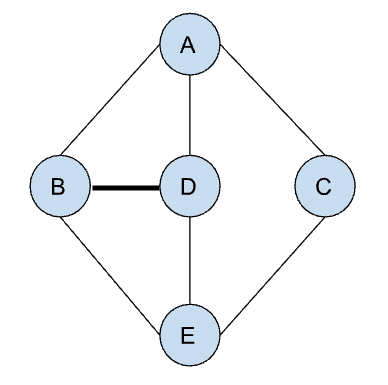

<h1>Find all paths between two vertices</h1>

<h2>Algorithm</h2>
<ul>
    <li>We will be using depth first search (DFS)</li>
    <li>For each neighbor, we will traverse as deep as we can go or until the destination is found</li>
    <li>When we find the destination, the path should be added to the list of paths.</li>
    <li>Each visited node should be marked as visited to avoid infinite loops. However, after traversing all the neighbors, the node should be removed from the visited list because there could be another path through this node.</li>
</ul>