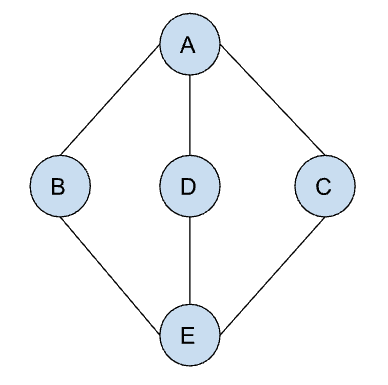

<h1>Traverse all the vertices with DFS</h1>

<h2>Algorithm</h2>
<ul>
    <li>Because we are using the depth first search algorithm, for each neighbor, we need to traverse as deep as we can go, before going to the next neighbor.</li>
    <li>DFS can be implemented by using recursion or stack. In this solution, we will be using recursion. </li>
    <li>A vertex shold not be traversed more than once. To prevent infinite loops, we'll be using a set which tracks the visited verticies.</li>
</ul>